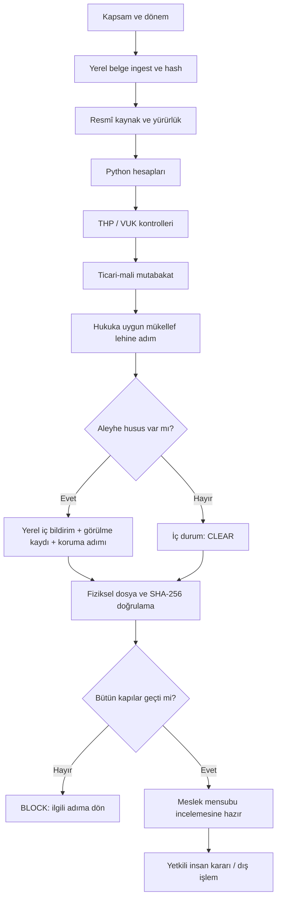

# Mali Müşavirim'i Yazılımı Çalıştırmadan Anlama Rehberi

Bu metin, Python veya terminal bilmeyen bir mali müşavirin sistemi kavraması için hazırlanmıştır. Buradaki işletme, belge ve tutarlar tamamen kurgusaldır. Amaç ekran veya komut öğretmek değil; sistemin bir dosyayı hangi meslek mantığıyla ele aldığını göstermektir.

## 1. Sistemi tek cümlede düşünün

Mali Müşavirim, muhasebe kayıtlarını kendi başına onaylayan bir program değil; **dosyayı kabul eden, kapsamı belirleyen, resmî dayanağı kaydeden, sayıları Python ile yeniden hesaplayan, THP/VUK kurallarını denetleyen, mükellef lehine hukuka uygun adımı hazırlayan, aleyhe hususu meslek mensubuna özel iç kayıtta gösteren ve işi ancak bütün kapılar geçince profesyonel incelemeye hazır sayan ikinci göz sistemidir.**

Sistemin çıktısı “beyanname doğrudur” veya “vergi riski yoktur” değildir. Çıktı şudur:

> Tanımlı kontroller şu girdiler ve şu kaynaklarla çalıştı; şu noktalar geçti, şu noktalar uyarı verdi, şu noktalar işi durdurdu; meslek mensubunun önündeki karar dosyası budur.

## 2. Bir mali müşavirin günlük işine karşılığı

Bir dosya masaya geldiğinde deneyimli mali müşavir çoğu zaman zihninde şu sırayı izler:

1. Bu işletme kimdir, hangi dönem ve hangi amaç inceleniyor?
2. Genel Tekdüzen mi, özel sektör planı mı uygulanır?
3. Defter, belge, mizan ve beyanname birbirini tutuyor mu?
4. Hesap kodu doğru mu, borç/alacak dengesi var mı?
5. Kayıt süresi, belge ve tevsik şartı sağlanmış mı?
6. Ticari sonuç ile vergi sonucu aynı mı, fark nereden geliyor?
7. Mükellef için en doğru ve hukuka uygun düzeltme veya savunma adımı ne?
8. Mükellef aleyhine hangi risk var ve bunu kim görüp karar verecek?
9. Dosya imza, beyan, tasdik veya dış sunum öncesi gerçekten hazır mı?

Sistem bu mesleki refleksi kalıcı çalışma kâğıtlarına ve makinece denetlenen kapılara dönüştürür. Böylece bir kontrolün yapılıp yapılmadığı yalnız “baktım” beyanına kalmaz.

## 3. Sistemin parçalarını ofis benzetmesiyle anlayın

| Sistem parçası | Ofisteki karşılığı |
|---|---|
| Yerel ingest | Gelen evrak kayıt ve arşiv masası |
| Kaynak korpusu | Güncel mevzuat ve standart kitaplığı |
| Hesaplama motoru | Hesabı gösteren, tekrar çalıştırılabilir hesap makinesi |
| THP/VUK motoru | Hesap planı ve kayıt düzeni kontrol listesi |
| Vergi müfettişi yeteneği | İnceleme gelmeden önce dosyaya karşı taraftan bakan ikinci göz |
| YMM yeteneği | Tasdik dosyasındaki bağımsızlık, kanıt ve rapor kalite kontrolü |
| Mükellef menfaati motoru | Lehe adım ile aleyhe iç risk kaydını zorunlu tutan karar masası |
| Vaka iş akışı | Bütün imzalar tamamlanmadan dosyayı çıkarmayan son kontrol |
| SHA-256 makbuzu | Dosyanın sonradan değiştirilip değiştirilmediğini gösteren dijital mühür izi |

Bu parçalar birbirinin yerine geçmez. Örneğin THP motorunun bir hesabı katalogda bulması, faturanın gerçek olduğunu veya işlemin ekonomik özünün doğru yorumlandığını kanıtlamaz.

## 4. Uçtan uca kurgusal vaka

### 4.1 Masaya gelen dosya

Kurgusal `MASKED-LTD` işletmesinin dönem içi bir alış faturası incelensin:

- mal/hizmet bedeli: 100.000,00 TL,
- örnekte kullanılan KDV oranı: %20,
- KDV: 20.000,00 TL,
- fatura toplamı: 120.000,00 TL,
- ödeme banka hesabından yapılmış,
- muhasebe kaydında 120.000,00 TL'nin tamamı gider hesabına yazılmış,
- indirilecek KDV ayrılmamış.

Bu örnekteki hesaplar `Decimal` ile çalıştırılmış Python hesabından alınmıştır. Gerçek vakada oran ve indirim hakkı işlem tarihinde resmî kaynaktan ayrıca doğrulanır; örnek bir mevzuat sonucu değildir.

### 4.2 İlk soru: kapsam nedir?

Sistem önce “hata var mı?” diye atlamaz. Şunları sabitler:

- işletmenin türü,
- hesap dönemi,
- işlemin tarihi,
- inceleme amacı,
- finansal raporlama çerçevesi,
- VUK/MSUGT vergi katmanı,
- önemlilik,
- para birimi.

Neden? Aynı kayıt genel THP kullanan bir işletmede başka, özel sektörel hesap planına tabi bir kuruluşta başka kontrol seti gerektirir. Tarih bilinmeden oran, süre ve yürürlük belirlenemez.

### 4.3 İkinci soru: hangi belgeye dayanıyoruz?

Fatura, banka dekontu, yevmiye satırı ve varsa sözleşme yerel vaka klasörüne alınır. Sistem her özgün dosya için SHA-256 özeti üretir. Belgenin metni çıkarılır fakat özgün belge değiştirilmez.

Bu aşamada hash şu işe yarar: daha sonra “hangi faturaya göre hesap yapıldı?” sorusunun cevabı dosya adına değil, dosyanın değişmez parmak izine bağlanır.

### 4.4 Üçüncü soru: mevcut kayıt mekanik olarak ne söylüyor?

Mevcut kayıt kurgusal olarak şöyledir:

| Hesap | Borç | Alacak |
|---|---:|---:|
| 770 Genel Yönetim Giderleri | 120.000,00 | 0,00 |
| 320 Satıcılar | 0,00 | 120.000,00 |

Borç ve alacak denktir. Bu nedenle yalnız denklik kontrolü yapılırsa kayıt “dengeli” görünür. Fakat dengeli kayıt her zaman doğru kayıt değildir. Sistem bu ayrımı özellikle korur:

- **aritmetik denklik:** 120.000,00 = 120.000,00,
- **hesap sınıflandırması ve vergi katmanı:** indirilecek KDV'nin ayrılıp ayrılmadığı,
- **ekonomik öz ve belge:** giderin niteliği ve indirim şartlarının gerçekten sağlanıp sağlanmadığı.

### 4.5 Dördüncü soru: doğru olabilecek kayıt nedir?

Örnekte indirim şartlarının sağlandığı varsayılırsa hazırlanacak kayıt taslağı:

| Hesap | Borç | Alacak |
|---|---:|---:|
| 770 Genel Yönetim Giderleri | 100.000,00 | 0,00 |
| 191 İndirilecek KDV | 20.000,00 | 0,00 |
| 320 Satıcılar | 0,00 | 120.000,00 |

Mevcut kayıt bozulup silinmez. Muhasebe usulüne uygun düzeltme taslağı hazırlanır:

| Hesap | Borç | Alacak |
|---|---:|---:|
| 191 İndirilecek KDV | 20.000,00 | 0,00 |
| 770 Genel Yönetim Giderleri | 0,00 | 20.000,00 |

Python hesabına göre gider 20.000,00 TL fazla görünmüş; aynı tutarda indirilecek KDV ayrılmamıştır. Gerçek dosyada bu taslak, belgenin niteliği, indirim hakkı, dönem ve beyan durumu doğrulanmadan kayda alınmaz.

## 5. Aynı vakada “mükellef lehine” ne demektir?

Sistem bu hatayı gördüğünde yalnız “yanlış kayıt” demez. Hukuka uygun koruma yolunu hazırlar.

Bu örnekte olası lehe adım:

1. faturanın indirim şartlarını taşıyıp taşımadığını doğrulamak,
2. eksik dayanak varsa tamamlamak,
3. uygun düzeltme kaydını hazırlamak,
4. beyanname verilmediyse doğru döneme doğru şekilde taşımak,
5. beyanname verilmişse işlem tarihindeki düzeltme ve başvuru yollarını resmî kaynaktan belirlemek,
6. süre varsa son günü Python ile hesaplamak,
7. karar için mali müşavire seçenek, kanıt ve etki dosyası sunmak.

Buradaki “lehine” doğru verginin gizlenmesi değildir. Mükellefin mevcut hakkını kaybetmemesi, gereksiz maliyet veya ikrar yaratılmaması ve doğru prosedürün zamanında hazırlanmasıdır.

## 6. Aynı vakada “aleyhe iç bildirim” ne demektir?

Bu örneğin aleyhe tarafları şunlar olabilir:

- giderin 20.000,00 TL fazla kaydedilmiş olması,
- indirilecek KDV hesabının ayrılmamış olması,
- yanlış döneme etki ihtimali,
- belge veya indirim şartının eksik olma ihtimali,
- beyanname verildiyse düzeltme gereksinimi.

Sistem bu noktaları müşteriye, idareye veya üçüncü kişiye otomatik göndermez. Kullanıcı/SMMM/YMM için yerel bir iç risk kaydı hazırlar. Kayıt şu soruları cevaplar:

- Sorun nedir?
- Hangi belge veya kayıt bunu gösteriyor?
- Hangi mevzuat kontrol edilecek?
- Sayısal etki hangi Python dosyasında hesaplandı?
- Mükellefi koruyacak adım hangisidir?
- Kim bilgilendirildi?
- Kim, hangi tarihte gördü?
- Dosya sonradan değişti mi?

Meslek mensubu bu kaydı görüp kabul etmeden vaka kapanmaz. Böylece sistem dış taslakta gereksiz öz-zarar üretmezken iç analizdeki riski de saklayamaz.

## 7. Neden fiziksel dosya ve hash zorunlu?

Bir yapay zekâ veya kullanıcı “düzeltme planını hazırladım” yazabilir. Fakat gerçekte dosya yoksa bu beyan denetlenemez.

v0.0.3 şu iki kanıtı birlikte ister:

1. çalışma kâğıdının vaka klasöründe kimliği eşleşen UTF-8 JSON dosyası olarak bulunması,
2. dosya baytlarının SHA-256 değerinin motor sonucundaki değerle eşleşmesi.

Dosya eksikse, başka dosyayla değiştirilmişse veya sonuç JSON'u elle düzenlenmişse kapanış kapısı geçmez. Bu, “iş yapıldı” beyanını “işin kanıtı var” düzeyine taşır.

## 8. THP/VUK motoru bu vakada neyi denetler?

Motor yalnız kendisine verilen ve kataloğunda bulunan mekanik kuralları sınar:

- 770, 191 ve 320 hesap kodlarının katalog durumu,
- hesap kodu ile hesap adının uyumu,
- işletmenin genel THP kapsamına girip girmediği,
- 7/A ve 7/B hesaplarının karıştırılıp karıştırılmadığı,
- borç/alacak denkliği,
- yevmiye satırlarının sıra ve tekrar durumu,
- kayıt ve belge tarihlerinin sağlanan VUK zaman politikasına uyumu,
- düzeltmenin silme/üzerine yazma yerine muhasebe kaydıyla yapılması,
- belge türü ve numarası gibi tevsik alanları,
- yabancı para varsa TRY karşılığı ve izin kanıtı.

Motor şu sonuçları tek başına vermez:

- fatura gerçektir,
- hizmet gerçekten alınmıştır,
- KDV kesin indirilebilir,
- gider kesin kabul edilir,
- beyanname doğrudur.

Bunlar belge, ekonomik öz, güncel mevzuat ve mesleki yargı gerektirir.

## 9. Vergi müfettişi bakışı aynı dosyaya nasıl yaklaşır?

`taxpayer_readiness` modunda sistem dosyaya şu sorularla bakar:

- Fatura, banka ve kayıt zinciri tutarlı mı?
- İndirilecek KDV neden ayrılmamış?
- Giderin dönemi ve niteliği doğru mu?
- Beyanname ve mizan kayıtla mutabık mı?
- Mükellefin açıklaması ve dayanak belgeleri dosyada mı?
- İdarenin kurabileceği en güçlü risk hipotezi nedir?
- Bu hipotezi hangi kanıt doğrular veya çürütür?
- Mükellefin hangi hakkı, süresi veya açıklama imkânı korunmalı?

Bu bir resmî vergi incelemesi değildir. Sistem kimlik ibraz etmez, belge talep etmez, tutanak imzalamaz ve rapor düzenlemez.

Gerçek `authorized_inspector_support` modunda tarafsızlık daha da belirgindir. Lehe ve aleyhe kanıt birlikte dosyalanır. Mükellef lehine düzeltme veya açıklama da, aleyhe bulgu da saklanmaz. Sistem yalnız karar materyali üretir; kamu yetkisini kullanmaz.

## 10. YMM bakışı aynı dosyaya nasıl yaklaşır?

Dosya tasdik kapsamındaysa YMM yeteneği önce şu kapıları denetler:

- gerçek YMM ve uygun çalışma modu var mı?
- ruhsat, çalışanlar listesi ve mühür kanıtı gerekli modda mevcut mu?
- yazılı sözleşme ve tasdik kapsamı açık mı?
- bağımsızlık ve ilişki engeli kontrol edildi mi?
- YMM'nin defter tutma yasağı ve görev ayrımı korunuyor mu?
- yeterli ve güvenilir kanıt var mı?
- mali tablo, defter ve beyannameler mutabık mı?
- karşıt inceleme gerekiyorsa yapıldı mı veya yapılamama etkisi açıklandı mı?

Örnekteki hata düzeltilebiliyorsa sistem düzeltme yolunu mükellef lehine hazırlar. Düzeltilemiyor ve tasdik sonucunu etkiliyorsa husus iç bildirimden rapor etkisi/kapsam sınırlaması/iş kabulü değerlendirmesine taşınır. “Mükellef lehine” gerekçesi YMM'nin bağımsızlığını veya doğru raporlama yükümlülüğünü kaldıramaz.

## 11. Finansal raporlama ve vergi sonucu neden ayrılır?

Bir iktisadi işlemin TMS/TFRS, BOBİ FRS veya KÜMİ FRS ölçümü ile VUK değerleme ve matrah sonucu farklı olabilir. Sistem bu farkı hata saymadan önce iki katmanda gösterir:

- **finansal raporlama katmanı:** finansal tablonun seçilen raporlama çerçevesine göre sonucu,
- **vergi katmanı:** VUK ve ilgili vergi mevzuatına göre değerleme/matrah sonucu,
- **mutabakat:** iki sonuç arasındaki geçici veya sürekli fark.

Örneğin finansal raporlamada ayrılan bir karşılığın vergi matrahında o tarihte kabul edilmemesi, kaydın yok sayılması demek değildir. Ticari sonuç ile mali sonuç arasında ilave/indirim veya ertelenmiş vergi analizi gerekebilir.

## 12. Sonuç kararlarını bir trafik ışığı gibi okuyun

| Karar | Anlamı | Mali müşavirin davranışı |
|---|---|---|
| `PASS` | Tanımlı blok ve uyarı yok | Yine de mesleki doğruluk ve belge incelemesini tamamla |
| `PASS_WITH_WARNINGS` | Mekanik kapılar geçti, açıklanması gereken anomali var | Uyarıyı incele, gerekçeyi çalışma kâğıdına yaz |
| `BLOCK` | Zorunlu iş kuralı geçmedi | Düzeltmeden veya eksik kanıtı tamamlamadan ilerleme |
| `ERROR` | Şema, veri tipi, katalog veya sistem sorunu | Muhasebe sonucu üretilmiş sayma; teknik girdiyi düzelt |

Önemli ayrım: `BLOCK`, mutlaka vergi ziyaı veya meslek hatası bulunduğu anlamına gelmez. Bazen yalnız zorunlu kanıtın veya tarih bilgisinin eksik olduğunu gösterir. Fail-closed yaklaşım, bilinmeyeni “uygun” saymaz.

## 13. Üç kısa örnekle kapının davranışı

### Örnek A — Risk yok, lehe süreç adımı var

Mizan, yevmiye ve belgeler mutabık. Sistem yine de “beyan öncesi son çapraz kontrol” gibi uygulanabilir bir mükellef koruma adımı hazırlar. Aleyhe husus olmadığı için iç bildirim durumu `CLEAR` olur. Fiziksel lehe adım dosyası ve hash doğrulanırsa kapı geçebilir.

### Örnek B — Risk var ama bildirim görülmemiş

Belge-kayıt farkı bulundu, koruma adımı yazıldı ve iç bildirim dosyası hazırlandı. Fakat kullanıcı/SMMM/YMM “gördüm” kaydı vermedi. Sistem `BLOCK` verir. Çünkü bilgilendirme yalnız dosyanın oluşturulması değil, yetkili insanın riskten haberdar olmasıdır.

### Örnek C — Lehe adımın süresi geçmiş

Bir itiraz veya başvuru adımı hazırlanmış, fakat son gün as-of tarihinden önce kalmış. Motor süreyi geçmiş olarak işaretler. Başka güncel ve uygulanabilir lehe adım yoksa vaka kapanmaz. Sistem “hazır dosya var” beyanıyla işlevsiz bir adımı geçerli saymaz.

## 14. Bir dosyanın tamamlanma zinciri

Son kutu özellikle önemlidir: sistemin tamamlanması ile beyan, tasdik, imza veya resmî gönderim aynı şey değildir.

## 15. Python zorunluluğunun mesleki anlamı

Sistem basit toplamayı bile Python ile yapar. Amaç hesap makinesine güvensizlik değil, **hesabın yeniden üretilebilir olmasıdır**.

Bir hesap izi şunları korur:

- girdi tutarları,
- kullanılan oran veya kur,
- kaynağın tarihi,
- ara adımlar,
- yuvarlama yöntemi,
- çıktı,
- girdi ve çıktı hash'leri.

Parasal hesapta ikili kayan nokta (`float`) yerine `Decimal` kullanılır. Böylece kuruş ve yuvarlama kuralı açıkça yönetilir. Tarih, sıralama, örneklem ve mutabakat da aynı nedenle çalıştırılan Python koduna bağlanır.

## 16. Mali müşavir sistemi nasıl kullanır?

Yazılım ayrıntısına girmeden gerçek iş akışı şöyledir:

1. **Dosyayı tanımlar:** dönem, işletme, amaç, çerçeve ve önemlilik.
2. **Veriyi yerelde verir:** mizan, yevmiye, belge ve beyannameleri vaka klasöründe tutar.
3. **Kolonları doğrular:** hesap kodu, hesap adı, borç/alacak, tarih ve belge alanlarının ne olduğunu açıklar.
4. **Kaynak tarihini belirler:** hangi tarih itibarıyla mevzuat uygulanacağını söyler.
5. **Motor bulgularını okur:** bulgu kimliği, önem seviyesi, kanıt ve kaynak bağını inceler.
6. **Mesleki kararı verir:** ekonomik öz, belge gerçekliği ve mevzuat yorumunu değerlendirir.
7. **Lehe adımı onaylar:** düzeltme, kanıt, açıklama, hak veya başvuru yolunu seçer.
8. **Aleyhe iç bildirimi görür:** riski küçültmeden, dışarı gereksiz ifşa etmeden karar verir.
9. **Yeniden çalıştırır:** düzeltmeden sonra aynı kontrolleri tekrar koşturur.
10. **Dış işlemi kendisi yapar/onaylar:** beyan, imza, tasdik veya resmî sunum yetkili insanda kalır.

## 17. Muhasebeci ve mali müşavir konuya nasıl vakıf olur?

### Aşama 1 — Kavramları öğrenin

Önce şu ayrımları oturtun:

- `PASS` ile mesleki onay aynı değildir.
- Borç/alacak denkliği ile doğru hesap sınıflandırması aynı değildir.
- THP hesap kodu ile finansal raporlama ölçüm ilkesi aynı değildir.
- Finansal raporlama kârı ile vergi matrahı aynı değildir.
- Uyarı ile blok aynı değildir.
- İç risk kaydı ile dış müşteriye/idareye sunulan metin aynı değildir.
- Mükellef lehine adım ile gerçeği gizlemek aynı değildir.

### Aşama 2 — Örnek JSON'u kayıt fişi gibi okuyun

Yazılım dili bilmeden de bir JSON dosyasını form olarak okuyabilirsiniz. Alan adları fiş başlıkları gibidir:

- `as_of_date`: hangi tarih itibarıyla,
- `case_reference`: hangi maskeli dosya,
- `role_mode`: hangi mesleki rol,
- `favorable_actions`: hazırlanan lehe adımlar,
- `adverse_matters`: aleyhe iç riskler,
- `controls`: zorunlu etik ve yerel veri kapıları,
- `findings`: kontrol sonucu bulunan hususlar,
- `receipt_sha256`: sonuç makbuzu.

### Aşama 3 — Bulguyu beş soruyla inceleyin

Her bulguda şunları sorun:

1. Kural kimliği nedir?
2. `BLOCK`, `WARN` veya `INFO` mu?
3. Hangi kayıt/alan tetikledi?
4. Hangi kaynağa bağlandı?
5. Düzeltme veya açıklama sonrası aynı kontrol geçiyor mu?

### Aşama 4 — Küçük ve maskeli veriyle prova yapın

Gerçek müşteri dosyasından önce:

- 5-10 satırlık maskeli hesap listesi,
- tek dengeli ve tek dengesiz fiş,
- küçük bir mizan,
- bir lehe adım,
- bir aleyhe iç bildirim

üzerinden sonuç alanlarını okuyun. Amaç motoru “kandırmak” değil, hangi eksikliğin hangi kapıyı kapattığını anlamaktır.

### Aşama 5 — Gerçek veride görev ayrımı yapın

- Muhasebe personeli veri ve belge eşlemesini yapar.
- SMMM hesap, vergi ve beyan kararını inceler.
- YMM modu varsa bağımsızlık ve tasdik sorumluluğu gerçek YMM'de kalır.
- Yetkili inceleme modu varsa kamu yetkisi gerçek görevlendirilmiş kişide kalır.
- Teknik kullanıcı Python çıktısı ve hash bütünlüğünü doğrular; mesleki sonucu tek başına vermez.

## 18. Gerçek veriye geçmeden önce öğrenme kontrol listesi

- [ ] Genel THP ile sektörel özel hesap planını ayırabiliyorum.
- [ ] Hesap kodu/adı bulgusunun ekonomik özü tek başına kanıtlamadığını biliyorum.
- [ ] `PASS`, `PASS_WITH_WARNINGS`, `BLOCK`, `ERROR` farkını biliyorum.
- [ ] Finansal raporlama ve VUK katmanını ayrı okuyabiliyorum.
- [ ] Python hesap izinde girdi, ara adım, yuvarlama ve çıktıyı bulabiliyorum.
- [ ] `input_sha256`, `catalog.sha256` ve `receipt_sha256` farkını biliyorum.
- [ ] Mükellef lehine adımın yalnız hukuka uygun seçenek olduğunu biliyorum.
- [ ] Aleyhe hususun iç kayıtta saklanamayacağını biliyorum.
- [ ] İç bildirimin otomatik dış gönderim olmadığını biliyorum.
- [ ] SMMM/YMM imza ve kamu yetkisinin yazılıma geçmediğini biliyorum.
- [ ] Gerçek müşteri verisinin GitHub'a veya uzak analiz hizmetine gönderilmeyeceğini biliyorum.

Bu maddeler anlaşılmadan gerçek müşteri verisiyle üretim testi yapılmamalıdır.

## 19. Sistemin açık sınırları

Sistem:

- meslek ruhsatı veya kamu yetkisi vermez,
- beyanname göndermez,
- YMM raporunu imzalamaz veya mühürlemez,
- vergi inceleme raporu düzenlemez,
- belgenin gerçekliğini yalnız dosya içeriğinden garanti etmez,
- sahte belge veya suçluluk hakkında nihai sonuç vermez,
- güncel oran, had ve süreyi ezberden üretmez,
- eksik olguyu sessiz varsayımla tamamlamaz,
- aleyhe kanıtı gizlemez veya yok etmez,
- iç risk kaydını otomatik dışarı göndermez,
- genel THP'yi özel sektör planlarına otomatik uygulamaz.

## 20. Bu rehberden sonra okunacak sıra

1. [Mali Müşavir Kullanım Rehberi](MALI-MUSAVIR-KULLANIM-REHBERI.md): ayrıntılı THP, VUK, mizan, yevmiye ve sonuç alanları.
2. [Mükellef Menfaati ve İç Bildirim Rehberi](MUKELLEF-MENFAATI-VE-IC-BILDIRIM.md): lehe adım, aleyhe iç kayıt ve fiziksel hash kapısı.
3. [Vergi Müfettişi ve YMM Uygulama Rehberi](VERGI-MUFETTISI-YMM-REHBERI.md): rol, yetki, bağımsızlık ve tasdik kapıları.
4. Repo ana [README](../README.md): kurulum, komutlar, dosya yolları ve kaynak yenileme.

Bu okuma sırası tamamlandığında bir mali müşavir sistemin hangi kararı verdiğinden önce **neden o kapıyı çalıştırdığını, hangi kanıtı beklediğini ve hangi mesleki sorumluluğu insanda bıraktığını** anlayabilir.
